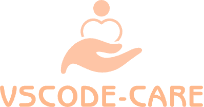

 <a href="./README.md">English</a> | 简体中文

为你保驾护航，时刻提醒你，注意休息，不要太倦

## 配置项

- `vscode-care.enabled`：启用/暂停扩展
- `vscode-care.workStart`：上班时间（24小时制），默认 `9:00`
- `vscode-care.workEnd`：下班时间（24小时制），默认 `18:00`
- `vscode-care.weekendBlock`：周末禁止 coding（撤销 + 弹窗）
- `vscode-care.waterReminder`：在你输入时，`xx:31` 左右提醒喝水
- `vscode-care.statusAnimation`：状态栏文案动画
- `vscode-care.breakReminder`：连续 coding 休息提醒
- `vscode-care.breakIntervalMinutes`：休息提醒间隔（分钟），默认 `50`
- `vscode-care.idleResetMinutes`：超过 N 分钟未输入则视为新一轮，默认 `5`

## 命令

- `vscode-care: Menu`（点击状态栏）
- `vscode-care: Toggle Enabled`
- `vscode-care: Snooze 10/30/60 Minutes`
- `vscode-care: Resume Notifications`
- `vscode-care: Allow Coding Today`
- `vscode-care: Open Today Report`

备注：

- `Snooze` 和 `Allow Coding Today` 会在窗口重载后保留（同一天内生效）。

## :coffee:

[请我喝一杯咖啡](https://github.com/Simon-He95/sponsor)

## License

[MIT](./license)

## Sponsors

  

